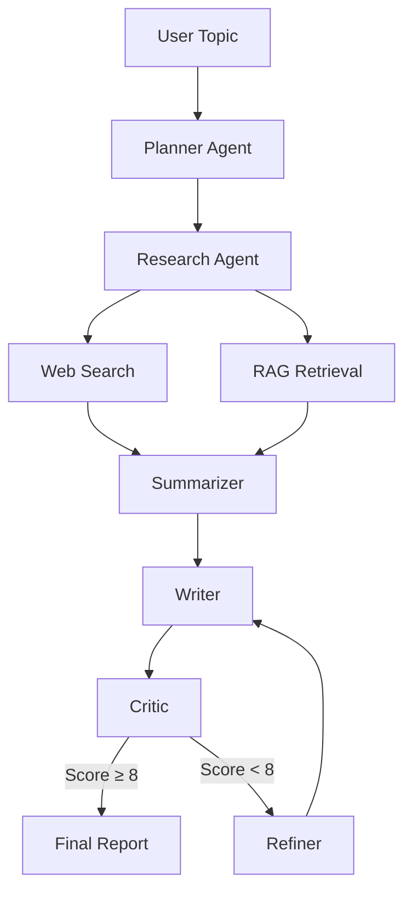
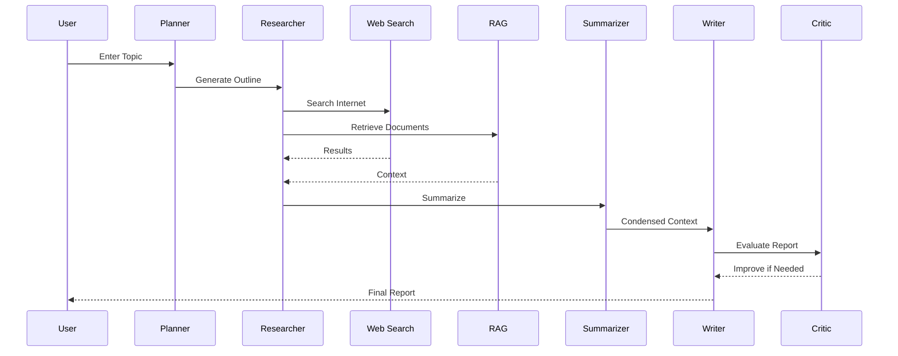

# 🤖 Multi-Agent Research Studio

> An autonomous multi-agent research system built with **LangGraph**, **OpenAI**, **Retrieval-Augmented Generation (RAG)**, and **Web Search** to generate high-quality research reports.


---

# 📖 Overview

Multi-Agent Research Studio is an autonomous AI research assistant that coordinates multiple specialized agents to generate comprehensive reports on any topic.

Instead of relying on a single LLM call, the system decomposes the task into multiple intelligent agents that collaborate through a LangGraph workflow.

The pipeline includes:

- 🧠 Planner Agent
- 🔍 Research Agent
- 📚 RAG Retrieval
- 🌐 Web Search
- ✍️ Summarizer
- 📝 Writer
- ✅ Critic
- 🔄 Refiner

---

# ✨ Features

- Multi-Agent Architecture
- LangGraph Workflow
- Retrieval-Augmented Generation (RAG)
- Web Search Integration
- PDF Knowledge Base
- Automatic Report Generation
- Self-Evaluation using Critic Agent
- Automatic Refinement Loop
- Modular Agent Design
- Easy to Extend

---

# 🏗 Architecture



---

# 🔄 Workflow



---

# 📂 Project Structure

```
multi-agent-research-studio/

├── app/
│   ├── agents/
│   ├── graph/
│   ├── llm/
│   ├── rag/
│   └── tools/
│
├── main.py
├── requirements.txt
├── .env.example
└── README.md
```

---

# 🧠 Agent Responsibilities

| Agent | Responsibility |
|--------|----------------|
| Planner | Creates a research outline |
| Researcher | Collects information using Web + RAG |
| Summarizer | Compresses retrieved context |
| Writer | Generates the research report |
| Critic | Evaluates report quality |
| Refiner | Improves reports with low scores |

---

# ⚙️ Tech Stack

- Python
- LangGraph
- OpenAI API
- LangChain
- FAISS
- Sentence Transformers
- Tavily Search
- PyPDF
- dotenv

---

# 🚀 Installation

Clone the repository

```bash
git clone https://github.com/Noman-ashraf1/multi-agent-research-studio.git

cd multi-agent-research-studio
```

Create virtual environment

```bash
python -m venv venv
```

Activate

Linux / macOS

```bash
source venv/bin/activate
```

Windows

```bash
venv\Scripts\activate
```

Install dependencies

```bash
pip install -r requirements.txt
```

Create a `.env` file

```text
OPENAI_API_KEY=your_api_key
TAVILY_API_KEY=your_api_key
```

Run

```bash
python main.py
```

---

# 📸 Demo

Coming Soon

---

# 🛣 Roadmap

- [ ] Streaming responses
- [ ] Multiple LLM support
- [ ] Docker deployment
- [ ] Web Interface
- [ ] Memory Agent
- [ ] Citation Generation
- [ ] PDF Export
- [ ] Async Execution

---

# 🤝 Contributing

Contributions are welcome!

Feel free to fork the repository and submit a pull request.

---

# 📜 License

This project is licensed under the MIT License.

---

# 👨‍💻 Author

**Noman Ashraf**

AI / ML Engineer

Interested in

- Generative AI
- Agentic AI
- LangGraph
- Retrieval-Augmented Generation
- Trustworthy AI
